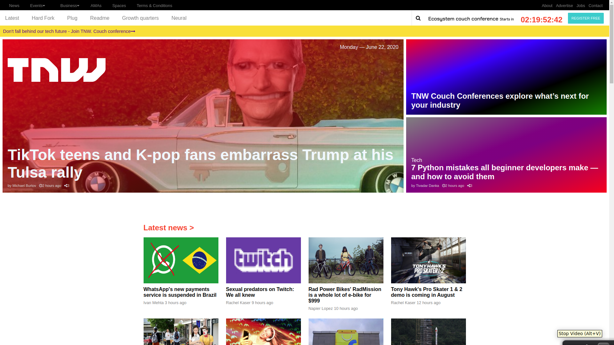

# The nextweb clone

This project was created  for learning purpose to practice responsiveness with CSS, by cloning [The next web page](https://thenextweb.com/) homepage

## Built With

- HTML
- CSS

## Live Demo

[Live Demo Link](https://fervent-mcnulty-8f2492.netlify.app/)

## Getting Started

**To view this project, download the contents of the repository to your computer or clone the repository and open the index.html file using your preferred browser.**

## Authors

¤ **MUGIRASE Emmanuel**

- Github: [@descholar-ceo](https://github.com/descholar-ceo)
- Linkedin : [@MUGIRASE Emmanuel](https://www.linkedin.com/in/mugirase-emmanuel-a90b49143/)
- Twitter: [@descholar](https://twitter.com/@descholar3)

¤ **Aldana Abril Longhi**

- Github: [@AlduLonghi](https://github.com/AlduLonghi)
- Linkedin : [@Aldana Abril Longhi](https://www.linkedin.com/in/aldana-abril-longhi-a842ba1a7/)
- Twitter: [@AbrilLonghi](https://twitter.com/AbrilLonghi)

##  Contributing

1. Fork this repo
1. Create a separate branch
1. Write some codes which express your contribution
1. Create a pull request comparing your branch to our masterbarnch

## Show your support

Give a  if you like this project

## Acknowledgments

- [Microverse](https://microverse.org)
- [The next web](https://thenextweb.com/)
- [The odin project](https://www.theodinproject.com/)

## Licences 
- This project is [MIT](https://github.com/microverseinc/readme-template/blob/master/lic.url) licensed.